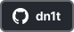

<!-- SVGs used in this file are available in Figma: https://www.figma.com/file/uncTRGGOaZ2NuVHQ57NxIg/GitHub-profile-README.md-SVGs -->

  

  <picture>
    <source media="(prefers-color-scheme: dark)" srcset="names/dark.svg">
    <source media="(prefers-color-scheme: light)" srcset="names/light.svg">
    
  </picture>

  <!--
    The old URL fragment method is deprecated.

    
    
  -->

17yo[^1] student developer & designer.  
Born in 2006, Programming since 2017.

[^1]: 19 in [Korean age](https://en.wikipedia.org/wiki/East_Asian_age_reckoning)

  
&nbsp;&nbsp;^ wanna use this widget too? check out [dn1t/readme-widgets](https://github.com/dn1t/readme-widgets)
